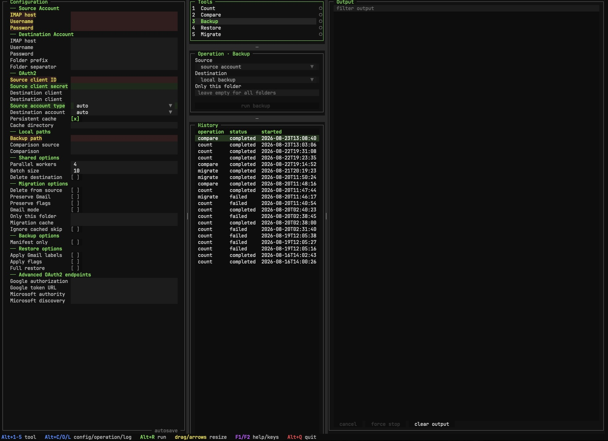

# IMAP Email Migration Tools


[](https://codecov.io/github/JCallico/imap-migration-tools)


A collection of command-line tools for migrating, backing up, restoring, counting, and comparing email on IMAP
servers. The tools were created for large migrations where simpler clients timed out or could not resume reliably.

They support password and OAuth2 authentication, incremental operation, Gmail labels, standard IMAP flags, local
`.eml` backups, and destination synchronization.

> These tools can copy and delete email. Test with non-critical data, verify counts and backups, and review destructive
> options before using them on an important account. The software is provided without warranty.

## Commands

| Installed command | Source entry point | Purpose |
|---|---|---|
| `imap-migrate` | `src/imap_migrate.py` | Copy or move email between IMAP accounts |
| `imap-backup` | `src/imap_backup.py` | Download an IMAP account as `.eml` files |
| `imap-restore` | `src/imap_restore.py` | Upload a local backup to an IMAP account |
| `imap-compare` | `src/imap_compare.py` | Compare folder counts across IMAP or local sources |
| `imap-count` | `src/imap_count.py` | Count messages on an account or in a local backup |
| `imap-tools` (beta) | `src/tui/app.py` | Configure and run all tools in a full-screen terminal interface |

Legacy script names remain available as compatibility wrappers.

## Installation

Python 3.9 or newer is required. Install the standard commands using `pipx`:

```bash
pipx install imap-migration-tools
```

Or use pip in a virtual environment:

```bash
python3 -m venv .venv
source .venv/bin/activate
python -m pip install imap-migration-tools
```

The standard installation supports command-line arguments, OS environment variables, and automatic `.env` loading.
The legacy `imap-migration-tools[dotenv]` spelling remains accepted, but the extra is no longer necessary.

### Full-screen terminal interface (beta)

The beta Textual interface provides one responsive, full-terminal application for configuring and running Count,
Compare, Backup, Restore, and Migrate. Install the optional TUI dependencies with `pipx`:

```bash
pipx install "imap-migration-tools[tui]"
```

If `imap-migration-tools` is already installed through `pipx`, reinstall it with the TUI extra:

```bash
pipx install --force "imap-migration-tools[tui]"
```

Launch the interface with the installed command:

```bash
imap-tools
```

For a standard virtual environment:

```bash
python -m pip install "imap-migration-tools[tui]"
imap-tools
```

The interface provides a guided autosaving `.env` form, operation-specific configuration readiness checks, one
history-backed output view, cancellation, and local run history. Existing commands remain available and are launched
as isolated subprocesses by the interface.



To run the TUI directly from the project folder without installing the package, first install the development
dependencies in `.venv`, then run:

```bash
PYTHONPATH=src .venv/bin/python -m tui.app
```

The TUI is currently beta software. Review the generated command in the Output panel and verify backups and counts
before enabling destructive options.

Drag the visible `│` and `─` separators between panels to resize adjacent columns or rows. Separators are also
keyboard accessible: focus one with `Tab`, then use the arrow keys shown in the footer. Double-click a separator to
reset it, or press `Alt+0` to reset the complete layout. Customized panel sizes are restored on the next launch, and
minimum pane sizes prevent a panel from disappearing. In wide layouts, the saved left-side divider positions remain
fixed while Output absorbs any width added or removed when the terminal is resized.

At 90–140 terminal columns the workspace uses a two-column layout with Output across the bottom. Below 90 columns,
panels use a full-width stacked layout with compact Tools, Operation, and History sections. Desktop splitter sizes are
preserved when entering either responsive layout and restored when the terminal becomes wide again.

Press `F2` for the complete keyboard reference or `F1` for general application help. Both references open over
the workspace and may be scrolled without leaving the current configuration or run context.

For terminals with limited Unicode support, launch the interface in ASCII compatibility mode. It uses `+`, `-`, and
`|` borders, ASCII status markers, and bold or reverse-video state cues that do not depend on color:

```bash
imap-tools --display-mode ascii
```

The equivalent persistent shell setting is `IMAP_TOOLS_DISPLAY_MODE=ascii`. Supported values are `auto`, `standard`,
and `ascii`. The default `auto` mode selects ASCII for `TERM=dumb` or a non-UTF-8 locale; use the explicit option when
a terminal reports inaccurate capabilities. `NO_COLOR` is honored in every mode. Textual's detected standard or
colorless output also enables the same high-contrast, color-independent state styling while Textual handles color-depth
conversion.

The interface discovers `.env` from the current directory and its parents, using the same precedence as the scripts:
per-run choices, existing OS environment variables, `.env`, then defaults. Passwords and OAuth client secrets are
masked in the form; new `.env` files and saved history use owner-only permissions where the platform supports them.
Destructive options require typing `DELETE` before a run starts.

The TUI checks `.env` for external edits once per second. Valid changes automatically repopulate Configuration and
refresh operation readiness. Invalid files leave the current form untouched and display an error. If an external edit
arrives while a form autosave is pending, the valid external file takes precedence so it is not overwritten.

Basic password authentication needs no additional authentication package. OAuth2 provider dependencies are installed
by the project. Encrypted persistent caching on Linux requires the `linux-keyring` extra and native system libraries.
See [Installation](docs/installation.md) for platform and source setup.

## Quick start

To configure the tools with the included `.env` support, copy the safe template:

```bash
cp .env.example .env
```

Edit `.env` with source and destination credentials. The template enables password authentication by default; OAuth2
values are empty. Configure only one authentication method per account.

Migrate all folders:

```bash
imap-migrate
```

Or provide a complete account directly:

```bash
imap-migrate \
  --src-host "imap.gmail.com" \
  --src-user "source@gmail.com" \
  --src-pass "source-app-password" \
  --dest-host "imap.example.com" \
  --dest-user "destination@example.com" \
  --dest-pass "destination-password"
```

Back up and verify an account:

```bash
imap-backup \
  --src-host "imap.gmail.com" \
  --src-user "you@gmail.com" \
  --src-pass "app-password" \
  --dest-path "./mail-backup"

imap-compare \
  --src-host "imap.gmail.com" \
  --src-user "you@gmail.com" \
  --src-pass "app-password" \
  --dest-path "./mail-backup"
```

## Configuration essentials

Configuration precedence is:

1. Command-line arguments
2. Existing OS environment variables
3. `.env` values
4. Script defaults

Authentication is resolved as one choice, so a higher-precedence password cannot be displaced by a lower-precedence
OAuth client ID, or vice versa. A host is an account boundary: when overriding a host, provide its username and password
or OAuth client ID from the same or a higher-precedence source.

Environment-backed booleans have positive and negative CLI forms. For example:

```bash
imap-migrate --src-delete
imap-migrate --no-src-delete
imap-backup --dest-delete
imap-backup --no-dest-delete
```

When local, source, and destination count targets coexist, choose explicitly:

```bash
imap-count --target local
imap-count --target source
imap-count --target destination
```

See [Configuration](docs/configuration.md) for all precedence, authentication, mode-selection, namespace, and boolean
rules.

## Common workflows

- [Migration, backup, restore, count, and comparison examples](docs/workflows.md)
- [OAuth2 setup for Microsoft and Google](docs/oauth2.md)
- [Troubleshooting and operational safety](docs/troubleshooting.md)
- [Development, testing, and CI](docs/development.md)

For large migrations, start with a count, run a non-destructive copy, compare the result, and only then consider
deletion or synchronization options.

## Contributing

Create a virtual environment, install the project and development requirements, then run:

```bash
make ci
```

See [Development](docs/development.md) and [AGENTS.md](AGENTS.md) for the complete contributor workflow and repository
conventions.

## License

Licensed under the [MIT License](LICENSE).
